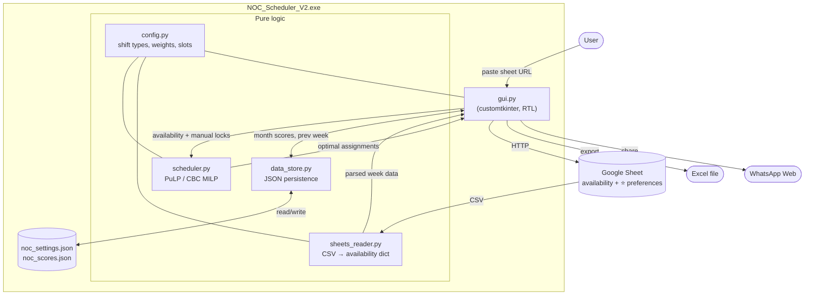

# NOC Shift Scheduler — V2

> Automated weekly shift scheduling for a Network Operations Center (NOC), with hard constraints, fairness balancing and a Hebrew RTL desktop UI.

The application pulls weekly availability and preferences from a public Google Sheet, runs a Mixed-Integer Linear Programming (MILP) solver to produce an optimal schedule, allows manual overrides, persists fairness scores across months, and exports the schedule to Excel or sends it via WhatsApp.

**Authors:** [Guy Yad](https://github.com/GuyYad00) · [Eli Levy](https://github.com/Elilevy52)

---

## Table of Contents

- [Features](#features)
- [Architecture](#architecture)
- [Project Structure](#project-structure)
- [Module Responsibilities](#module-responsibilities)
- [Algorithm Overview](#algorithm-overview)
- [Constraints Reference](#constraints-reference)
- [Google Sheets Input Format](#google-sheets-input-format)
- [Persistent Data Files](#persistent-data-files)
- [Installation (Development)](#installation-development)
- [Building the Standalone EXE](#building-the-standalone-exe)
- [Usage Workflow](#usage-workflow)
- [Tech Stack](#tech-stack)
- [Authors](#authors)

---

## Features

- **Google Sheets ingestion** — fetches availability + preference markers (`✔️`, `⭐`) from a public sheet, no auth required.
- **MILP optimization** — uses [PuLP](https://github.com/coin-or/pulp) with the bundled CBC solver to produce an optimal weekly schedule.
- **Hard constraints** — 8-hour rest, no consecutive nights, max consecutive working days, on-call cannot overlap with evening/night, double morning slots Sun–Tue.
- **Fairness balancing** — minimizes the spread of night counts, on-call counts and weighted day-score across employees, with a separate monthly history per employee (split into `day` weighted score and `night` count).
- **Manual override + heatmap** — every cell in the grid is an editable dropdown; cell colors reflect availability density (red = nobody available, yellow = single candidate) and assignment source (manual/auto/warning).
- **Cross-week continuity** — remembers last Saturday's shift per employee and current work streak so that the new week respects the rest gap and fatigue rules.
- **Customizable settings** — minimum shifts per employee, max consecutive days, employee exclusion list (e.g. managers excluded from fairness balancing), monthly/all-time score reset.
- **Export** — writes a styled, RTL Excel workbook; one-click "send via WhatsApp Web" with a pre-formatted Hebrew message.
- **Standalone EXE** — `build.bat` produces a single self-contained `.exe` via PyInstaller (CBC, Tcl/Tk, customtkinter and CRT DLLs are all bundled).

---

## Architecture

The application is a layered desktop app. The GUI is the only entry point; all other modules are pure logic and can be tested independently.



### Data flow per week

1. **Import** — User pastes a Google Sheets URL → `sheets_reader.fetch_and_parse` downloads CSV via the `gviz` endpoint and parses it into `{employees, day_names, dates, availability, preferences, notes}`.
2. **Render** — `gui.App._build_schedule_table` draws a 5-row grid (`בוקר א`, `בוקר ב`, `ערב`, `לילה`, `כונן`) × N days. Cell background reflects availability density (heatmap).
3. **Manual edits** — Every dropdown change goes through `_on_cell_change`, which records the assignment and flags it as a manual lock.
4. **Solve** — Clicking "שבץ אוטומטי" calls `scheduler.schedule_shifts` on a background thread. Manual locks are passed as hard constraints. Historical month scores and previous-week shifts are pulled from `data_store`.
5. **Approve & save** — Result is rendered back into the grid; if it requires multi-night assignments, a confirmation dialog asks the user. "אשר ושמור" persists `day` (weighted) + `night` (count) deltas to `noc_scores.json` and the last-Saturday state to `noc_settings.json`.
6. **Distribute** — Export to Excel (RTL, color-coded) or open WhatsApp Web with a pre-built Hebrew summary.

---

## Project Structure

```
V2/
├── main.py                    # Entry point — launches the GUI
├── gui.py                     # CustomTkinter UI, dialogs, Excel export
├── scheduler.py               # MILP model (PuLP/CBC) + fairness logic
├── sheets_reader.py           # Google Sheets CSV download & parsing
├── data_store.py              # JSON persistence (settings + monthly scores)
├── config.py                  # Shift types, weights, time windows, constants
├── requirements.txt           # Python dependencies
├── build.bat                  # PyInstaller one-file build script
├── NOC_Scheduler_V2.spec      # Generated PyInstaller spec
└── README.md
```

---

## Module Responsibilities

| Module | Responsibility |
|---|---|
| `main.py` | Imports `App` from `gui` and starts the Tk main loop. |
| `config.py` | All tuneable constants: shift types (`בוקר`, `ערב`, `לילה`, `כונן`), shift time windows, day-type weights (weekday / friday / saturday), preference bonus, on-call balance weight, double-morning days (Sun–Tue), helpers `slots_for_day_shift`, `iter_all_slot_keys`, `normalize_assignment_key`. |
| `sheets_reader.py` | `extract_sheet_id` / `extract_gid` from URL, `fetch_sheet_csv` via the `gviz` CSV endpoint, `parse_availability` — handles merged-cell forward fill, distinguishes availability (`✔️`, `V`, `1`, `כן`…) from explicit preference (`⭐`, `P`, `עדיפות`), and accumulates free-text notes per employee. |
| `data_store.py` | Locates `noc_*.json` next to the EXE in frozen mode (or next to the script in dev). Reads/writes settings + scores. Provides current-month split (`{day: float, night: int}`) and combined integer view used by the solver. Computes work-streaks and last-Saturday state from a finalized week. |
| `scheduler.py` | Builds and solves the MILP with PuLP. Two-phase strategy (max 1 night per employee → max 2 nights only if it covers more slots). Produces `assignments`, `week_scores`, `total_scores`, `unfilled`, `night_counts` and a flag for multi-night approval. |
| `gui.py` | All UI state and rendering: header + URL input, status bar, schedule grid with heatmap, action bar (auto-schedule, save, WhatsApp, export), fairness dashboard, settings dialog (constraints + exclusion list + reset), historical statistics window. |

---

## Algorithm Overview

The scheduler solves a Mixed-Integer Linear Program at each click of "שבץ אוטומטי".

**Decision variables**

- `x[e, d, s, slot] ∈ {0,1}` — employee `e` is assigned to slot `(d, s, slot)`.
- `fill[d, s, slot] ∈ {0,1}` — slot is filled by exactly one employee.

**Hard constraints**

- Coverage: `Σ_e x[e,d,s,slot] = fill[d,s,slot]`.
- Availability: `x = 0` for shifts the employee did not mark (unless manually locked).
- Manual locks: `x[emp,d,s,slot] = 1` for every locked cell.
- ≤ 1 regular shift per employee per day.
- 8-hour rest: forbidden consecutive pairs across days — `(ערב→בוקר)`, `(לילה→בוקר)`.
- No consecutive nights: `x[e,d,לילה,0] + x[e,d+1,לילה,0] ≤ 1`.
- Cross-week rest: same rules applied vs. last Saturday's shift.
- Fatigue: max consecutive working days (default 6) sliding window, including the streak carried over from previous week.
- On-call cannot overlap evening/night for the same employee on the same day.
- Min shifts per employee (default 3) — only enforced if the employee is available for at least that many shifts.
- Max nights per employee — phase 1 = 1, phase 2 = 2.

**Objective (maximize)**

```
10000 · Σ fill                              # coverage dominates
   + 0.2 · Σ x[e,d,s,slot]·preferred(e,d,s) # ⭐ bonus
   −  500 · (max_nights − min_nights)        # night-count fairness
   −   80 · (max_oncall − min_oncall)        # on-call fairness
   −    5 · (max_day_score − min_day_score)  # day-weight fairness (incl. history)
   −  3·penalty(gap=2 days) − 1·penalty(gap=3 days)   # spread nights apart
```

When more than two on-call volunteers exist, an additional hard constraint `kon[e1] − kon[e2] ≤ 1` is attempted first; if infeasible, the solver falls back to soft balancing.

**Two-phase strategy**

1. Try `max_nights_per_emp = 1`. If the result is fully optimal (all slots filled), return it.
2. Otherwise try `max_nights_per_emp = 2`. If it covers strictly more slots than phase 1, prefer it — but require user approval since some employees will have ≥ 2 nights that week.

---

## Constraints Reference

| Setting | Default | Where |
|---|---|---|
| Min shifts per employee | 3 | Settings dialog (`min_shifts`) |
| Max consecutive working days | 6 | Settings dialog (`max_consecutive_days`) |
| Min rest between shifts | 8 h | `config.MIN_GAP_HOURS` (encoded as forbidden pairs) |
| Preference bonus per `⭐` | 0.2 | `config.PREFERENCE_BONUS` |
| On-call balance weight | 80 | `config.ONCALL_BALANCE_WEIGHT` |
| Solver time limit | 60 s | `scheduler._get_solver` |
| Double morning slot days | Sun, Mon, Tue | `config.DOUBLE_MORNING_DAY_INDICES` |

Day-type weights (used both in the objective and in the persisted `day` score):

| Shift | Weekday | Friday | Saturday |
|---|---:|---:|---:|
| בוקר | 1.0 | 1.0 | 1.5 |
| ערב | 1.0 | 1.5 | 1.2 |
| לילה | 0.12 | 1.5 | 0.28 |
| כונן | 0.4 | 0.4 | 0.4 |

Weekday night is intentionally low so morning/evening dominate the day-score gap; weekend nights stay higher to reflect the actual premium.

---

## Google Sheets Input Format

The reader expects a sheet shared as **"Anyone with the link can view"** in this layout:

| Row | A | B | C | D | E | F | G | H | I | … |
|---|---|---|---|---|---|---|---|---|---|---|
| 1 | _empty_ | date1 | _(merged)_ | _(merged)_ | _(merged)_ | date2 | … | | | … |
| 2 | יום | ראשון | _(merged)_ | _(merged)_ | _(merged)_ | שני | … | | | … |
| 3 | משמרת | בוקר | ערב | לילה | כונן | בוקר | ערב | לילה | כונן | … |
| 4+ | _employee name_ | ✔️ | ⭐ | _empty_ | ✔️ | … | | | | |

Accepted markers:

- **Available**: `✔️`, `✔`, `V`, `v`, `✓`, `TRUE`, `1`, `כן`, `x`, `X`, `⭐`, `P`
- **Preference (⭐ bonus)**: `⭐`, `P`, `עדיפות`
- **Anything else** (e.g. "שמרתי על אבא"): treated as a free-text note attached to that employee, **not** as availability.

Merged date / day cells are automatically forward-filled.

---

## Persistent Data Files

Both files live next to the EXE (or next to the scripts in dev mode):

### `noc_settings.json`
```json
{
  "sheet_url": "https://docs.google.com/.../edit#gid=0",
  "excluded_employees": ["שם מנהל"],
  "last_saturday_by_employee": { "דניאל": "ערב", "רותם": "לילה" },
  "work_streaks": { "דניאל": 4, "רותם": 1 },
  "min_shifts": 3,
  "max_consecutive_days": 6
}
```

### `noc_scores.json`
```json
{
  "2026-04": {
    "דניאל": { "day": 12.5, "night": 3 },
    "רותם":  { "day":  9.0, "night": 4 }
  },
  "2026-03": { ... }
}
```

The split format (`day` weighted score, `night` raw count) lets the dashboard show the two metrics independently while the algorithm still uses a combined value (`day + night`) for fairness balancing.

---

## Installation (Development)

Requires Python 3.10+ on Windows.

```powershell
cd V2
python -m venv .venv
.\.venv\Scripts\Activate.ps1
pip install --upgrade pip
pip install -r requirements.txt
python main.py
```

`requirements.txt`:

```
customtkinter>=5.2.0
requests>=2.31.0
PuLP>=2.7.0
openpyxl>=3.1.0
pyinstaller>=6.0.0
```

PuLP ships with the CBC solver binary, no extra install needed.

---

## Building the Standalone EXE

`build.bat` produces a single-file `.exe` with all dependencies bundled:

```powershell
cd V2
.\build.bat
```

What the script does:

1. Installs/upgrades `pip`, dependencies and `pyinstaller` inside `.venv`.
2. Resolves the absolute path to the `customtkinter` package and the bundled CBC `cbc.exe`.
3. Bundles Tcl/Tk DLLs and a few CRT DLLs from your local Anaconda install (`C:\Users\<you>\anaconda3\Library\bin`) — these paths can be adjusted at the top of `build.bat`.
4. Cleans `dist/` and `build/`, then runs PyInstaller in `--onefile --windowed` mode.
5. Output: `dist\NOC_Scheduler_V2.exe`.

> The first run of the EXE may take a few seconds while PyInstaller's bootloader extracts to a temp dir.

---

## Usage Workflow

1. **Paste** the Google Sheets URL in the header → **ייבוא נתונים**.
2. The grid is populated; cells turn **red** if no one is available, **yellow** if only one person is.
3. Optionally lock specific assignments by picking from the dropdown — they will be respected as hard constraints.
4. Click **▶ שבץ אוטומטי**. If the optimizer needs to give someone two nights in the week, you'll be asked to approve.
5. Inspect the **fairness dashboard** at the bottom — color tags show who is high / balanced / low for the month.
6. **✓ אשר ושמור** persists the week's `day` and `night` deltas, and the last-Saturday state for next week.
7. **📁 ייצוא לאקסל** writes an RTL Excel; **שלח ב-WhatsApp** opens WhatsApp Web with the schedule pre-formatted in Hebrew.
8. **⚙️ הגדרות** lets you change `min_shifts`, `max_consecutive_days`, employee exclusion list, or reset monthly / all-time history.

---

## Tech Stack

- **Python 3.10+**
- **GUI** — [`customtkinter`](https://github.com/TomSchimansky/CustomTkinter) (RTL-tweaked Tk)
- **Optimization** — [`PuLP`](https://github.com/coin-or/pulp) + bundled CBC solver
- **HTTP / parsing** — `requests`, `csv`
- **Excel export** — `openpyxl`
- **Packaging** — `PyInstaller` (one-file)

---

## Authors

This project was built collaboratively by:

| Author | GitHub |
|---|---|
| Guy Yad | [@GuyYad00](https://github.com/GuyYad00) |
| Eli Levy | [@Elilevy52](https://github.com/Elilevy52) |

Contributions, issues and feature requests are welcome — please open an issue or a pull request on the [repository](https://github.com/GuyYad00/NOC-Shift-Scheduler).
