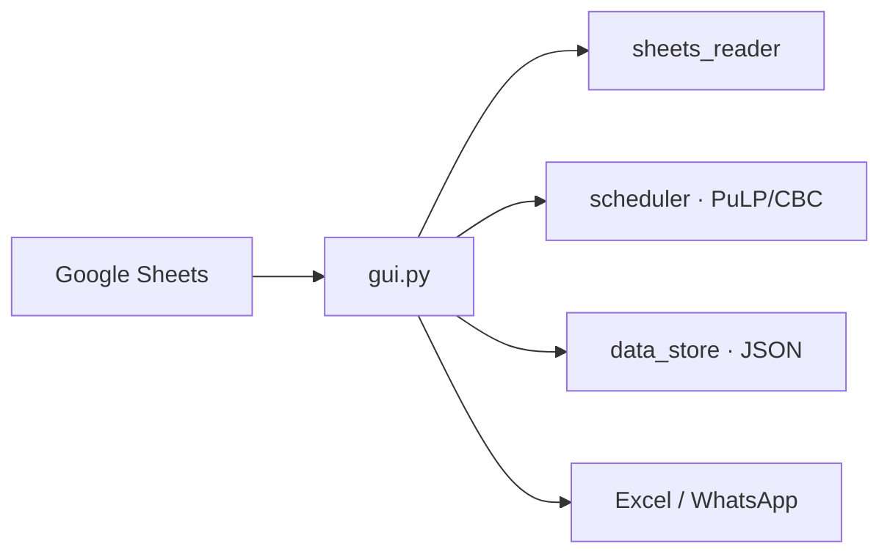

<p align="center">
  
</p>

<h1 align="center">NOC Shift Scheduler</h1>

<p align="center">
  <b>מערכת שיבוץ משמרות ל־NOC</b><br/>
  Optimal weekly shifts · Hebrew RTL desktop app · MILP solver
</p>

<p align="center">
  
  
  
  
</p>

---

Desktop app that turns a public **Google Sheet** of availability into a fair weekly NOC schedule — then lets you lock cells, export to Excel, or send it on WhatsApp.

## Stack

| | |
|---|---|
| **Language** | Python 3.10+ |
| **UI** | [customtkinter](https://github.com/TomSchimansky/CustomTkinter) · Hebrew RTL |
| **Solver** | [PuLP](https://github.com/coin-or/pulp) + CBC (MILP) |
| **Input** | Google Sheets CSV (`gviz`, no OAuth) |
| **Export** | openpyxl · WhatsApp Web |
| **State** | local JSON (`noc_settings.json`, `noc_scores.json`) |
| **Packaging** | PyInstaller → one-file `.exe` |

No server, no database, no login. One operator, one machine.

## Architecture



`main.py` launches the GUI. Everything else is pure logic: parse the sheet, solve the week, persist fairness scores.

## What it enforces

- Coverage first, then fairness (nights, on-call, weighted day score)
- 8-hour rest · no consecutive nights · max consecutive work days
- On-call cannot overlap evening/night
- Manual locks are hard constraints
- Last Saturday + work streaks carry into the next week
- ⭐ in the sheet is a preference bonus

## Quick start

```powershell
python -m venv .venv
.\.venv\Scripts\Activate.ps1
pip install -r requirements.txt
python main.py
```

Starter sheet (import into Google Sheets, share as *Anyone with the link can view*):  
[`templates/NOC_Availability_Template.xlsx`](templates/NOC_Availability_Template.xlsx)

1. Paste the sheet URL → **ייבוא נתונים**
2. Optionally lock cells
3. **שבץ אוטומטי** → **אשר ושמור**
4. Export Excel or send via WhatsApp

Build a standalone exe: `.\build.bat`

## Layout

```
main.py            entry
gui.py             RTL UI, export, WhatsApp
scheduler.py       MILP model
sheets_reader.py   Google Sheet → availability
data_store.py      JSON persistence
config.py          shifts, weights, constraints
templates/         starter Google Sheet
```

---

<p align="center">
  <sub>Built by <a href="https://github.com/GuyYad00">Guy Yad Shalom</a> · <a href="https://github.com/Elilevy52">Eli Levy</a></sub>
</p>
